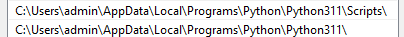
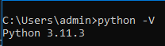
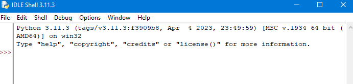
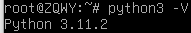
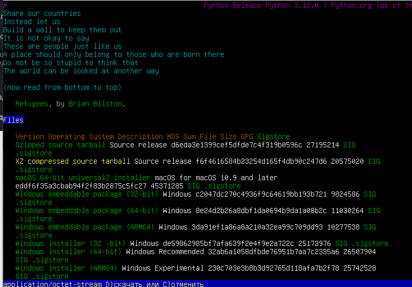
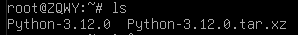
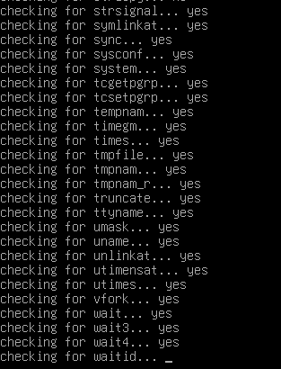
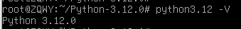

<h1>1. Установка на Windows</h1>

**Установил с офциального сайта Python данную версию**

**Проверяю переменную среду**

*Вау, всё круто и готово к работе*

**Делаю проверку в терминале**
>python -V

**Проверим IDLE**

*Отлично с установкой Python на Windows завершена*
___
Кстати, есть ещё более простой способ установить Python, через репозиторий Microsoft Store

<h1>2. Установка на Debian</h1>

Я люблю Debian и CentOS, но Debian - это мой главный любимчик :)

В обычном образе уже идёт пакет с Python 3.11

___
Ради интереса и развития, скомпилирую последнюю версию Python

**Идём на сайт Python.org**

Мне нужен будет XZ comp

Такс... нужно это разархивировать 
>tar -xvf Python-3.12.0.tar.xz

Видим такую картину:

**Установим нужные пакеты для компиляции**
>apt install wget build-essential libreadline-dev libncursesw5-dev libssl-dev libsqlite3-dev tk-dev libgdbm-dev libc6-dev libbz2-dev libffi-dev zlib1g-dev -y

**Проверим что ничего не потеряли**
>./configure --enable-optimizations

**Поехали собирать :)**
>make -j4 && sudo make altinstall

Этот процесс мягко говоря не быстрый, поэтому можно попить чай

*Урааа*

<h1>3. Установка на FreeBSD</h1>

>pkg update

>pkg install python3

Готово работаем...
